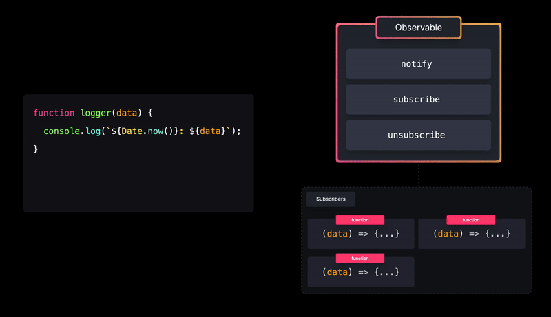
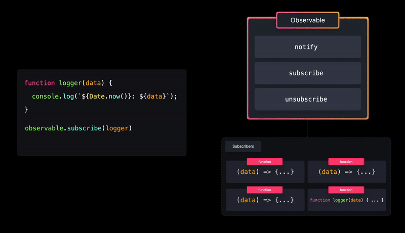

[← Back](../README.md)

# Obserber 패턴

**관찰자 패턴(Observer Pattern)** 은 이벤트가 발생할 때 옵저버블(`Observable`)을 사용해 구독자(`Subscriptor`)에게 알리는 방법입니다.

## 개요

관찰자 패턴을 사용하면 다음의 이점이 있습니다.

1. Observable - 구독자에게 알림을 보내는 "관찰 가능한" 객체입니다.
1. Subscriptor (Observer) - 관찰 가능한 객체를 "구독"하고 알림을 받을 수 있습니다.

예를 들어, 옵저버블(Observable)에 `logger` 구독자로 추가할 수 있습니다.

```js
Observable.subscribe(logger);
```



Observable에서 `notify()` 메서드가 호출되면 모든 구독자가 호출되고, 선택적으로 알림자의 데이터를 구독자에게 전달할 수 있습니다.

```js
Observable.notify('구독자 모두에게 알립니다!');
```



## 구현

`notify()`, `subscribe()`, `unsubscribe()` 메서드를 가진 옵저버블(observable) 싱글톤 객체를 생성하는 함수를 작성합니다.

```js
const observers = new Set();

const Observable = {
  notify(data) {
    observers.forEach(observer => observer(data))
  },
  subscribe(observer) {
    observers.add(observer);
  },
  unsubscribe(observer) {
    observers.delete(observer);
  }
};

export default Object.freeze(Observable);
```

애플리케이션에서 옵저버블(Observable) 모듈을 불러와 함수를 구독할 수 있습니다.

```js
import Observable from './Observable';

function logger(data) {
  console.log(`${Date.now()} ${data}`);
}

Observable.subscribe(logger);
```

특정 이벤트를 기반으로 모든 가입자에게 알립니다.

```js
import Observable from './Observable';

const demoButton = document.querySelector('#demo .Button');

demoButton.addEventListener('click', () => {
  Observable.notify('클릭');
});
```

## 트레이드 오프

### 관심사의 분리

관찰자(Observer) 객체는 관찰 가능한(Observable) 객체와 긴밀하게 결합되어 있지 않으며 언제든지 분리 가능합니다.
관찰 가능한 객체는 이벤트 모니터링을 담당하는 반면, 관찰자는 수신된 데이터만 처리합니다.

### 성능 이슈

관찰자 처리가 너무 복잡하거나, 알림을 보낼 구독자가 너무 많은 경우 모든 구독자에게 알리는 데 상당한 시간이 걸릴 수 있습니다.


## 실습

추가 버튼을 누르면 메인 영역의 목록에 새 항목이 추가되고, 헤더 영역에 항목 갯수가 표시되도록 구현합니다.
